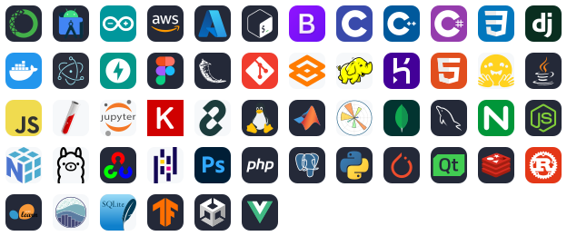

<h1 align="center">Hi 👋, I'm Enmao Diao (刁恩茂)</h1>
<h3 align="center">A curious entrepreneur and researcher</h3>

  

- 🤝 I’m open to research, product, and business collaborations.

- 📫 How to reach me [**enmao.diao@dreamsoul.com**](mailto:enmao.diao@dreamsoul.com)

- 📄 Know about me [**diaoenmao.com**](https://diaoenmao.com/)

<h3 align="left">Languages and Tools:</h3>

Full Stack

- **Languages:** [C](https://en.cppreference.com/w/c), [C++](https://isocpp.org/), [C#](https://learn.microsoft.com/dotnet/csharp/), [JavaScript](https://developer.mozilla.org/en-US/docs/Web/JavaScript), [Java](https://dev.java/), [MATLAB](https://www.mathworks.com/products/matlab.html), [PHP](https://www.php.net/), [Python](https://www.python.org/), [Rust](https://www.rust-lang.org/), [Bash](https://www.gnu.org/software/bash/), [HTML](https://developer.mozilla.org/en-US/docs/Web/HTML), [CSS](https://developer.mozilla.org/en-US/docs/Web/CSS)
- **AI & data science:** [Anaconda](https://www.anaconda.com/), [PyTorch](https://pytorch.org/), [TensorFlow](https://www.tensorflow.org/), [Keras](https://keras.io/), [scikit-learn](https://scikit-learn.org/), [OpenCV](https://opencv.org/), [Hugging Face](https://huggingface.co/), [LangChain](https://www.langchain.com/), [Ollama](https://ollama.com/), [Gradio](https://www.gradio.app/), [NumPy](https://numpy.org/), [Pandas](https://pandas.pydata.org/), [Seaborn](https://seaborn.pydata.org/), [Matplotlib](https://matplotlib.org/), [Jupyter](https://jupyter.org/)
- **Applications & web:** [Django](https://www.djangoproject.com/), [Flask](https://flask.palletsprojects.com/), [FastAPI](https://fastapi.tiangolo.com/), [Node.js](https://nodejs.org/), [Vue.js](https://vuejs.org/), [Bootstrap](https://getbootstrap.com/), [Electron](https://www.electronjs.org/), [Jekyll](https://jekyllrb.com/)
- **Databases & data systems:** [SQLite](https://www.sqlite.org/), [PostgreSQL](https://www.postgresql.org/), [MySQL](https://www.mysql.com/), [MongoDB](https://www.mongodb.com/), [Hadoop](https://hadoop.apache.org/), [Redis](https://redis.io/)
- **Cloud & infrastructure:** [AWS](https://aws.amazon.com/), [Azure](https://azure.microsoft.com/), [Docker](https://www.docker.com/), [Linux](https://www.kernel.org/), [Nginx](https://nginx.org/), [Heroku](https://www.heroku.com/), [Git](https://git-scm.com/)
- **Design & development:** [Figma](https://www.figma.com/), [Photoshop](https://www.adobe.com/products/photoshop.html), [Android Studio](https://developer.android.com/studio), [Arduino](https://www.arduino.cc/), [Qt](https://www.qt.io/), [Unity](https://unity.com/)

<h3 align="left">GitHub Stats</h3>

<h3 align="left">Most Used Languages</h3>

<h3 align="left">Contribution Streak</h3>

<h3 align="left">GitHub Trophies</h3>

